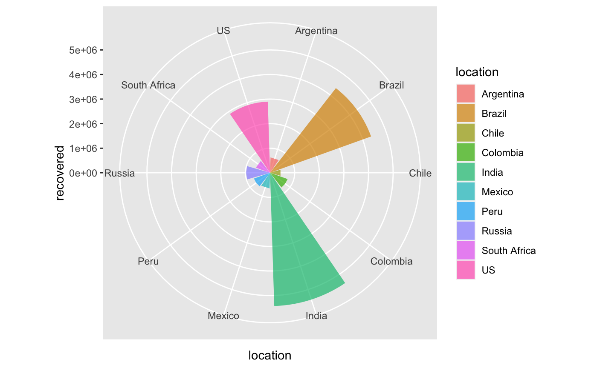
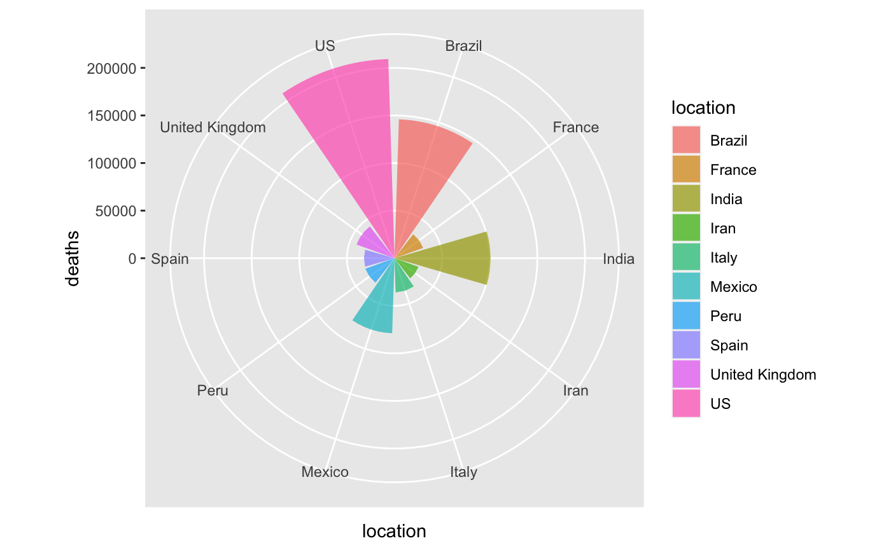
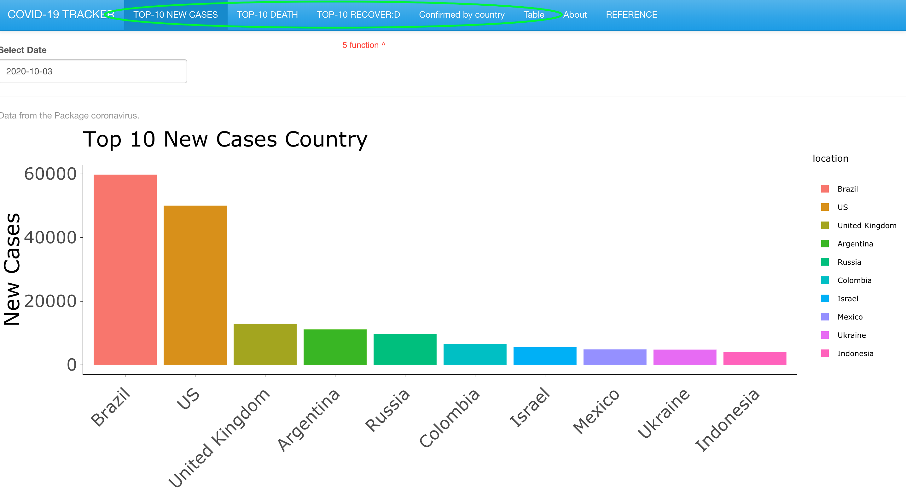
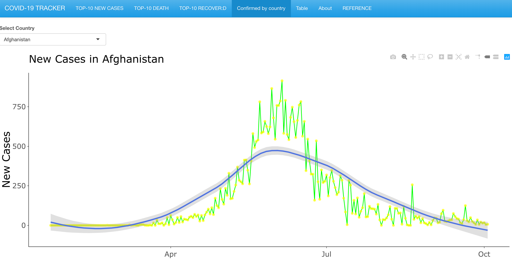

<!-- README.md is generated from README.Rmd. Please edit that file -->

# covid

<!-- badges: start -->

[](https://github.com/etc5523-2020/r-package-assessment-cgon0007/actions)
[](https://www.gnu.org/licenses/gpl-3.0)

<!-- badges: end -->

The goal of covid package is to provid the covid-19 data and function
for the people to explore. and it contain a coronavirus dateset, which
have 2000960 observations and 9 variables. Docs: data ,data\_type ,lat
,location ,location\_code ,location\_code\_type,location\_type,long
,value. **data**:the data **data\_type**:Data in Yyy **lat**:Latitude of
center of geographic region, defined as either country or, if available,
province **location**Name of province/state, for countries where data is
provided split across multiple provinces/states  
**location\_code**:Name of country/region **location\_code\_type**:the
type of location **location\_type**:country/state **long**:Longitude of
center of geographic region, defined as either country or, if available,
province **value**Number of cases on given date

## Installation

You can install the released version of covid\_tracker from
[CRAN](https://CRAN.R-project.org) with:

``` r
install.packages("covid")
```

And the development version from [GitHub](https://github.com/) with:

``` r
# install.packages("devtools")
devtools::install_github("etc5523-2020/r-package-assessment-cgon0007")
```

## Example

This is a basic example which shows you how to solve a common problem:

``` r
library(covid)
library(tibble)
coronavirus
#> # A tibble: 200,960 x 9
#>    date  location location_type location_code location_code_t… data_type value
#>    <chr> <chr>    <chr>         <chr>         <chr>            <chr>     <dbl>
#>  1 7/6/… Afghani… country       AF            iso_3166_2       cases_new   791
#>  2 6/6/… Afghani… country       AF            iso_3166_2       cases_new   582
#>  3 5/6/… Afghani… country       AF            iso_3166_2       cases_new   915
#>  4 18/5… Afghani… country       AF            iso_3166_2       deaths_n…     4
#>  5 8/6/… Afghani… country       AF            iso_3166_2       cases_new   575
#>  6 12/6… Afghani… country       AF            iso_3166_2       cases_new   656
#>  7 9/6/… Afghani… country       AF            iso_3166_2       cases_new   542
#>  8 4/6/… Afghani… country       AF            iso_3166_2       cases_new   787
#>  9 17/5… Afghani… country       AF            iso_3166_2       deaths_n…     1
#> 10 19/5… Afghani… country       AF            iso_3166_2       deaths_n…     5
#> # … with 200,950 more rows, and 2 more variables: lat <dbl>, long <dbl>
n_countries(coronavirus)
#> Warning: Unknown or uninitialised column: `country`.
#> [1] 0
## basic example code
```

### plot example





## shiny part

### here is the picture of shiny –the top\_10 new cases and new case trend plot

.  .

. 

. User can choose to run shinyChromosome installed on local computers
(Windows, Mac or Linux) for a more preferable experience. hint(the app
means that:covid19-tracker-shinyapp) Step 1: Install R and RStudio

Before running the app you will need to have R and RStudio installed
(tested with R 3.5.0 and RStudio 1.1.419). Please check CRAN
(<https://cran.r-project.org/>) for the installation of R. Please check
<https://www.rstudio.com/> for the installation of RStudio.

Step 2: Install the R Shiny package and other packages required by
shinyChromosome

Start an R session using RStudio and run these lines:

### try an http CRAN mirror if https CRAN mirror doesn’t work

`install.packages("shiny")` `install.packages("ggplot2")`
`install.packages("shinythemes")` `install.packages("coronavirus")`

### install shiny:covid\_tracker

`install.packages("devtools")`
`devtools::install_github("~cgon0007/app", force=TRUE)`

Step 3: Start the app

Start an R session using RStudio and run these lines:

`shiny::runGitHub("app", "cgon0007")`

This command will download the code of shinyapp from GitHub to a
temporary directory of your computer and then launch the app in the web
browser. Once the web browser was closed, the downloaded code of app
would be deleted from your computer. Next time when you run this command
in RStudio, it will download the source code of appcovid19tracker from
GitHub to a temporary directory again. This process is frustrating since
it takes some time to download the code of shinyChromosome from GitHub.

Users are suggested to download the source code of shinyChromosome from
GitHub to a fixed directory of your computer, such as ‘E:’ on Windows.a
zip file named ‘app-master.zip’ would be downloaded to the disk of your
computer. Move this file to ‘E:’ and unzip this file. Then a directory
named ‘app’ would be generated in ‘E:’.

Then you can start the app by running these lines in RStudio.

`library(shiny)` `runApp("E:/apps/app-master", launch.browser = TRUE)`

# REFERENCE

## citation

h2(“shiny,coronavirus,tidyverse,plotly,ggplot2”) h4(" Winston Chang, Joe
Cheng, JJ Allaire, Yihui Xie and Jonathan McPherson (2020). shiny: Web
Application Framework for R. R package version 1.5.0.
<https://CRAN.R-project.org/package=shiny> A BibTeX entry for LaTeX
users is @Manual{, title = {shiny: Web Application Framework for R},
author = {Winston Chang and Joe Cheng and JJ Allaire and Yihui Xie and
Jonathan McPherson}, year = {2020}, note = {R package version 1.5.0},
url = {<https://CRAN.R-project.org/package=shiny>}, }“), h1(”.“),
h4(”Wickham et al., (2019). Welcome to the tidyverse. Journal of Open
Source Software, 4(43), 1686, <https://doi.org/10.21105/joss.01686> A
BibTeX entry for LaTeX users is @Article{, title = {Welcome to the
{tidyverse}}, author = {Hadley Wickham and Mara Averick and Jennifer
Bryan and Winston Chang and Lucy D’Agostino McGowan and Romain François
and Garrett Grolemund and Alex Hayes and Lionel Henry and Jim Hester and
Max Kuhn and Thomas Lin Pedersen and Evan Miller and Stephan Milton
Bache and Kirill Müller and Jeroen Ooms and David Robinson and Dana
Paige Seidel and Vitalie Spinu and Kohske Takahashi and Davis Vaughan
and Claus Wilke and Kara Woo and Hiroaki Yutani}, year = {2019}, journal
= {Journal of Open Source Software}, volume = {4}, number = {43}, pages
= {1686}, doi = {10.21105/joss.01686}, } “), h1(”.“), h4(” C. Sievert.
Interactive Web-Based Data Visualization with R, plotly, and shiny.
Chapman and Hall/CRC Florida, 2020. A BibTeX entry for LaTeX users is
@Book{, author = {Carson Sievert}, title = {Interactive Web-Based Data
Visualization with R, plotly, and shiny}, publisher = {Chapman and
Hall/CRC}, year = {2020}, isbn = {9781138331457}, url =
{<https://plotly-r.com>}, }“), h1(”.“), h4(”Rami Krispin and Jarrett
Byrnes (2020). coronavirus: The 2019 Novel Coronavirus COVID-19
(2019-nCoV) Dataset. R package version 0.3.0.
<https://CRAN.R-project.org/package=coronavirus> A BibTeX entry for
LaTeX users is @Manual{, title = {coronavirus: The 2019 Novel
Coronavirus COVID-19 (2019-nCoV) Dataset}, author = {Rami Krispin and
Jarrett Byrnes}, year = {2020}, note = {R package version 0.3.0}, url =
{<https://CRAN.R-project.org/package=coronavirus>}, }“), h1(”.“), h4(”H.
Wickham. ggplot2: Elegant Graphics for Data Analysis. Springer-Verlag
New York, 2016. A BibTeX entry for LaTeX users is @Book{, author =
{Hadley Wickham}, title = {ggplot2: Elegant Graphics for Data Analysis},
publisher = {Springer-Verlag New York}, year = {2016}, isbn =
{978-3-319-24277-4}, url = {<https://ggplot2.tidyverse.org>}, }")
